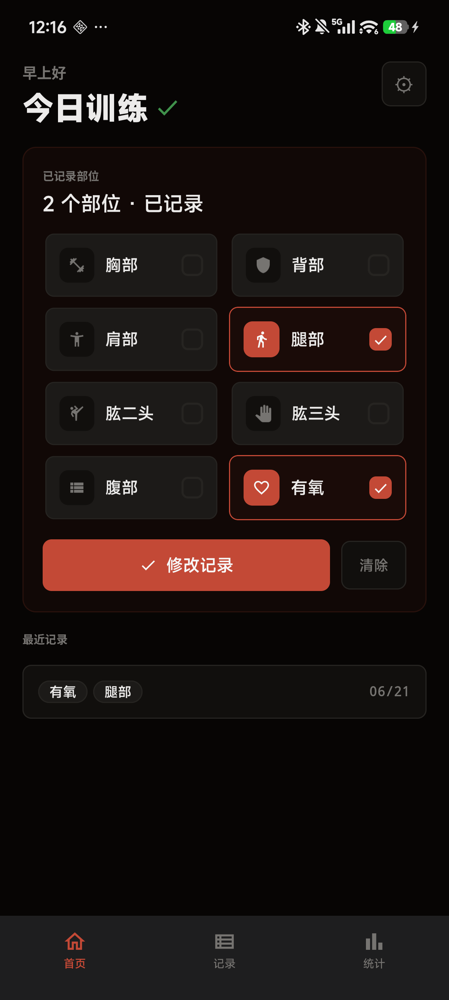
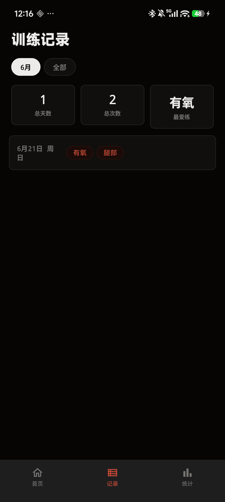
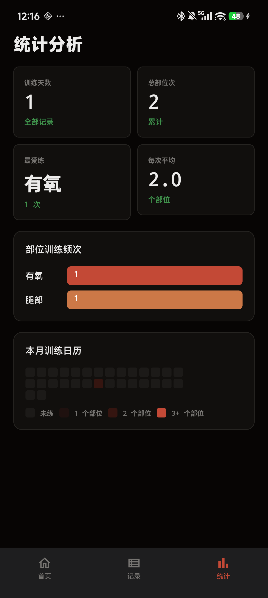

# 铁壳训练 (GymPulse)

一款为健身爱好者设计的极简训练记录 Android App。暗色工业锻造风格界面、本地存储、零网络依赖。

## 📱 截图

> 真实设备截屏 (Xiaomi 14, 1200×2670) — 严格依据 Open Design 项目「铁壳训练」的 `screens/*.html` 设计源实现。

| 首页 | 记录 | 统计 |
|:---:|:---:|:---:|
|  |  |  |

---

## ✨ 功能

### 🏋️ 首页
- 动态问候语（早上好 / 下午好 / 晚上好）
- 8 个训练部位多选芯片：胸部 / 背部 / 肩部 / 腿部 / 肱二头 / 肱三头 / 腹部 / 有氧
- 一键保存今日训练，绿色闪动反馈
- 显示最近 3 条训练记录

### 📋 记录
- 按月份动态筛选
- 总天数 / 总次数 / 最爱练 统计摘要
- 按日期分组的训练日志列表
- **长按**任意记录可删除

### 📊 统计
- 2×2 统计大数字：训练天数 / 总部位次 / 最爱练 / 每次平均
- 部位训练频次水平条形图
- 本月训练日历热力图

### ⚙️ 数据持久化
- 所有数据存储在手机本地 Room 数据库
- 支持**导出 JSON 备份**到 Download 目录
- 重装 app 后可通过**导入 JSON 恢复**数据
- 系统设置入口：首页右上角 ⚙ 按钮

---

## 🏗️ 技术栈

| 项目 | 版本 |
|------|------|
| 语言 | Kotlin 2.0 |
| UI | Jetpack Compose (Material 3) |
| 数据库 | Room 2.6 |
| 导航 | Navigation Compose |
| 构建 | Gradle 8.9 + AGP 8.5.2 |
| JDK | 17 / 21 |
| minSdk | 26 (Android 8.0) |
| targetSdk | 35 (Android 15) |

## 🏛️ 架构

MVVM + Repository + 单向数据流：

```
UI (Compose)
  ↕ StateFlow
ViewModel
  ↕ suspend / Flow
Repository
  ↕ DAO
Room Database
```

## 🎨 设计系统

- **配色** — 工业锻造方向（锻铁黑底 + 锈橙强调色）
- **色值** — OKLCH 色彩空间，sRGB 精确转换
- **字体** — 三族体系：Display / Body / Mono
- **组件** — Material 3 + 自定义 12px 圆角卡片、8px 芯片

## 📁 项目结构

```
GymPulse/
├── app/
│   ├── build.gradle.kts
│   └── src/main/
│       ├── AndroidManifest.xml
│       ├── res/
│       │   ├── values/colors.xml, themes.xml
│       │   ├── drawable/ic_launcher_*.xml
│       │   ├── mipmap-anydpi-v26/ic_launcher.xml
│       │   └── xml/file_paths.xml
│       └── java/com/gympulse/app/
│           ├── GymPulseApp.kt          # Application + 单例
│           ├── MainActivity.kt         # 入口 + 底部导航
│           ├── data/
│           │   ├── entity/TrainingLog.kt
│           │   ├── dao/TrainingLogDao.kt
│           │   ├── AppDatabase.kt
│           │   ├── TrainingRepository.kt
│           │   ├── DataManager.kt      # 导入/导出
│           │   └── PreferenceManager.kt
│           └── ui/
│               ├── theme/              # Color / Type / Theme
│               ├── common/             # 共享组件
│               ├── home/               # 首页
│               ├── log/                # 记录
│               ├── stats/              # 统计
│               ├── settings/           # 设置
│               ├── workout/            # 训练确认
│               └── navigation/NavGraph.kt
├── build.gradle.kts
├── settings.gradle.kts
├── gradle.properties
├── gradle/wrapper/
├── gradlew
├── gympulse.keystore                  # Release 签名
└── docs/screenshots/                  # README 截图 (adb 真实设备截屏)
```

> 📐 **设计源文件**: `screens/01-home.html` / `02-log.html` / `03-workout.html` / `04-stats.html` 位于 Open Design 项目「铁壳训练」中，使用 OKLCH 色彩空间，Android 端经 Canvas API 精确转换为 sRGB 实现像素级还原。

## 🚀 构建

### Debug
```bash
./gradlew assembleDebug
```
输出：`app/build/outputs/apk/debug/app-debug.apk`

### Release
```bash
./gradlew assembleRelease
```
输出：`app/build/outputs/apk/release/app-release.apk`（已 R8 压缩 + 签名）

## 📲 安装

```bash
adb push app-release.apk /data/local/tmp/
adb shell pm install /data/local/tmp/app-release.apk
adb shell rm /data/local/tmp/app-release.apk
```

## 🗃️ 数据备份/恢复

| 操作 | 路径 |
|------|------|
| 导出 | 主页 → ⚙ → 导出训练记录 → 保存到 Download 目录 |
| 导入 | 主页 → ⚙ → 导入训练记录 → 选择 JSON 文件 |

备份文件命名：`gympulse_backup_yyyyMMdd_HHmmss.json`

---

## 📄 License

MIT License
